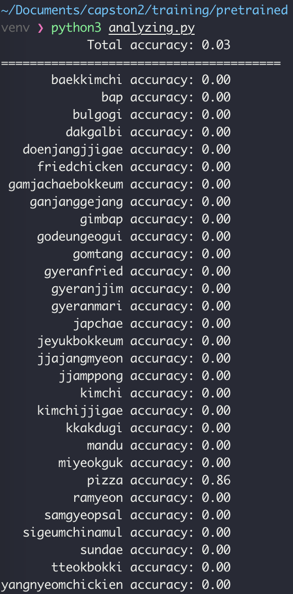
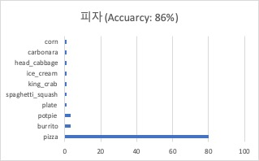
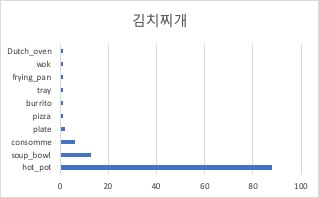

## Pretrained MobileNet V2
전이 학습 후 성능을 비교하기 위해서, 특징 추출기로 사용한 모델의 원본으로 테스트 데이터를 분류한 결과입니다.  
분류에는 다음 모델을 사용합니다
: [MobileNet V2 (depth multiplier 1.40)](https://tfhub.dev/google/imagenet/mobilenet_v2_140_224/classification/3)  
이 모델은 Imagenet (ILSVRC-2012-CLS)으로 학습되어 있습니다.

### 성능
  
- 전체 테스트 셋 분류 정확도 3%    

  
- pizza 분류 정확도 86%
- pizza 외의 label은 Imagenet에 존재하지 않기 때문에 낮은 성능을 보입니다.  

### Note

- 김치찌개를 훠궈(hot pot)로 분류합니다.
